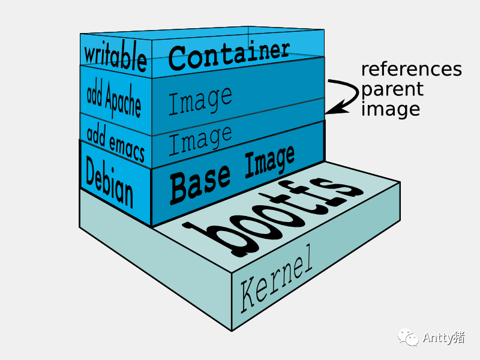

# 浅说Docker基础知识与核心原理

Docker是 dot cloud 公司使用 Go 语言推出的虚拟化技术，它基于 Linux 内核的 CGroup、Namespace、Union FS 等技术，对进程进行封装隔离。由于隔离的进程独立于宿主和其它的隔离的进程，因此被称为容器。Docker 在容器的基础上，进行了进一步的封装，从文件系统、网络互联到进程隔离等等，极大的简化了容器的创建和维护，使得 Docker 技术比虚拟机技术更为轻便、快捷。

## 一、基本知识
Docker中有三个重要的概念需要理解：
- 镜像（Image）：类似root文件系统，提供容器运行时所需的程序、库、资源、配置等文件；
- 容器（Container）：镜像运行时的实体，提供创建、启动、停止、删除、暂停等操作；
- 仓库（Repository）：代码控制中心，用于保存镜像；

Docker 官方会给用户提供一个官方的 [Docker 仓库](https://hub.docker.com)，它就像是手机里的应用商店，里面放着各种各样打包好的 Docker 镜像给用户下载；Docker 镜像就像我们从应用商店里下载下来的软件安装包，用户通过使用 Docker 镜像运行起来就创建 Docker 容器，这个过程就跟我们使用软件安装包完成应用的安装后使用并无太大差别。

## 二、常用命令
Docker常用操作如下：

### 2.1 获取镜像
格式：docker pull [选项] [Docker Registry 地址[:端口号]/]仓库名[:标签]

示例：docker pull nginx:1.0

### 2.2 镜像列表
格式：docker image [选项]

示例：docker images

### 2.3 删除镜像

格式：docker image rm <镜像名/ID>

示例：docker image rm 791285de22e4

### 2.4 创建容器

格式：docker run [选项] <镜像名>

示例：docker run -t -i nginx:1.0 /bin/bash

### 2.5 容器列表

格式：docker ps [选项] 

示例：docker ps -a

### 2.6 停止容器

格式：docker container stop <镜像名/ID>

示例：docker container stop 791285de22e4

### 2.7 删除容器

格式：docker rm [选项]  <容器名/ID>

示例：docker rm -f 791285de22e4

### 2.8 进入容器

格式：docker exec [选项]  <容器名/ID>  [命令]

示例：docker exec –it nginx bash


## 三、底层原理

容器的本质是进程，在 Docker 容器中 Namespace 做隔离、CGroup 做限制、rootfs 做文件系统，其核心原理实际上就是为待创建的用户进程：启动Linux Namespace配置、设置指定的CGroup参数、切换进程的根目录。我们接下来为将从从这三方面讲解Docker的底层原理。

### 3.1 联合文件系统

AUFS 是一种 Union File System（即联合文件系统 UnionFS，可以把不同物理位置的目录合并挂载到同一个目录中）,我们通过使用aufs来进行演示，它基础使用方式如下：

```shell
$ tree
.
├── fruits
│   ├── apple
│   └── tomato
└── vegetables
    ├── carrots
    └── tomato
```

创建一个挂载目录：

```shell
$ mkdir mnt
$ sudo mount -t aufs -o dirs=./fruits:./vegetables none ./mnt
```

说明：
- -t aufs：指定挂载类型为aufs
- -o dirs=./dir1:./dir2：将多个文件夹联合在一起
- none：aufs不需要设备，只依赖于-o dirs中指定的文件夹

接下来我们查看mnt结构：

```shell
$ tree

./mnt
├── apple
├── carrots
└── tomato
```
在 mount aufs 命令中，如果没有指定目录权限，则默认挂载的第一个目录时可读写的，后面则都是只可读状态。我们对 mnt 目录上进行操作，以下的结果均会反映在 mnt 和 fruits 目录中：

``` shell
$ touch ./mnt/tony.txt
$ echo tony.zhu >> ./mnt/apple
$ echo tony.zhu >> ./mnt/carrots
```

当然我们可以手动给文件夹赋予权限，当我们再对文件进行操作时，可能会与上述有所区别：
```shell
$ mount -t aufs -o dirs=./fruits=rw:./vegetables=rw none ./mnt
```

当vegetables拥有写权限时，以下操作的结果会反映在vegetables：
```shell
$ echo tony.zhu >> ./mnt/carrots
```

而对于有重复的文件名（如上述 tomato），在 mount 命令行上越往前就优先级越高，利用联合文件的这些特性，我们可以做出分层的镜像来。另外 Monut  Namespace 可以隔离文件系统的挂载点，使得不同的 Mount Namespace 拥有自己独立的挂载点信息（这些挂载点的根目录就是执行环境的文件系统，也被称为根文件系统 rootfs）。这两者也就构成了容器的文件系统的原型。

Docker文件系统示意图如下：


### 3.2 Namespace

Linux Namespace是Linux提供的一种内核级别环境隔离的方法，而namespace的使用方式也很简单，它只是Linux创建新进程时的一个可选参数，种类如下：

分类 | 系统调用参数 |	备注 |
--|--|--|
Mount	| CLONE_NEWNS |	挂载点 |
UTS	| CLONE_NEWUTS | hostname |
IPC |	CLONE_NEWIPC |	进程间通信 |
PID |	CLONE_NEWPID |	进程树 |
Network	| CLONE_NEWNET |	网络访问 |
User | CLONE_NEWUSER |	虚拟User与真实User的映射|

使用的方式如下：

```shell
$ int pid = clone(main_function, stack_size, CLONE_NEWNS|CLONE_NEWUTS|CLONE_NEWIPC|CLONE_NEWPID|CLONE_NEWNET|CLONE_NEWUSER, NULL)
```

Docker 的核心技术是通过 LXC 来实现类似 VM 的功能，从而利用更加节省的硬件资源提供给用户更多的计算资源，而 LXC 所实现的隔离性主要通过内核的命名空间将容器的文件系统、hostname、进程、消息、网络隔离开来。而 Docker 相比虚拟机的优势在于：

1. 虚拟机需要运行完整的操作系统才能执行用户的应用进程（在不做优化的情况下虚拟机自己就要占有100-200MB的内存）

2. 运行在虚拟机中的用户应用在对宿主机操作系统的系统需要经过虚拟化软件的拦截和处理，会带来性能上的损耗（尤其对计算资源、网络和磁盘I/O的损耗大）

相比之下容器化后的用户应用依然是宿主机上的普通进程，这意味着对额外的资源占用可以忽略不计，也没有因拦截处理而带来的性能损耗。而有利就有弊，基于 Linux Namespace 的隔离机制最主要的问题在于隔离得不彻底。因为多个容器之间使用的还是同一个操作系统内核，而很多资源是无法隔离的，比如：时间，在容器中的程序使用settimeofday(2)修改了时间会导致整个宿主机的时间都跟着变化。

3.3 Linux CGroup

Linux CGroup 全称Linux Control Group，是Linux内核中用来控制程组资源（包括CPU、内存、磁盘、输入输出）的一个功能。其提供的主要功能如下：

- Control：恢复/恢复进程；
- Accounting：统计，主要用于计费；
- Prioritization：优先级控制，比如：CPU利用和磁盘IO吞吐；
- Resource limitation：限制资源使用，如内存使用上限、文件系统的缓存限制；

在 Linux中，CGroup 给用户暴露出来的操作接口是文件系统，即它以文件和目录的方式组织在操作系统的 /sys/fs/cgroup 路径下，我们可以通过 mount 或者 lssubsys 查看 cgroup：

```shell
$ mount -t cgroup
> cgroup on /sys/fs/cgroup/systemd type cgroup (rw,nosuid,nodev,noexec,relatime,xattr,release_agent=/lib/systemd/systemd-cgroups-agent,name=systemd)
> cgroup on /sys/fs/cgroup/blkio type cgroup (rw,nosuid,nodev,noexec,relatime,blkio)
> cgroup on /sys/fs/cgroup/devices type cgroup (rw,nosuid,nodev,noexec,relatime,devices)
> cgroup on /sys/fs/cgroup/hugetlb type cgroup (rw,nosuid,nodev,noexec,relatime,hugetlb)
> cgroup on /sys/fs/cgroup/net_cls,net_prio type cgroup (rw,nosuid,nodev,noexec,relatime,net_cls,net_prio)
> cgroup on /sys/fs/cgroup/cpu,cpuacct type cgroup (rw,nosuid,nodev,noexec,relatime,cpu,cpuacct)
> cgroup on /sys/fs/cgroup/pids type cgroup (rw,nosuid,nodev,noexec,relatime,pids)
> cgroup on /sys/fs/cgroup/cpuset type cgroup (rw,nosuid,nodev,noexec,relatime,cpuset)
> cgroup on /sys/fs/cgroup/perf_event type cgroup (rw,nosuid,nodev,noexec,relatime,perf_event)
> cgroup on /sys/fs/cgroup/memory type cgroup (rw,nosuid,nodev,noexec,relatime,memory)
> cgroup on /sys/fs/cgroup/freezer type cgroup (rw,nosuid,nodev,noexec,relatime,freezer)

$ lssubsys  -m
> cpuset /sys/fs/cgroup/cpuset
> cpu,cpuacct /sys/fs/cgroup/cpu,cpuacct
> blkio /sys/fs/cgroup/blkio
> memory /sys/fs/cgroup/memory
> devices /sys/fs/cgroup/devices
> freezer /sys/fs/cgroup/freezer
> net_cls,net_prio /sys/fs/cgroup/net_cls,net_prio
> perf_event /sys/fs/cgroup/perf_event
> hugetlb /sys/fs/cgroup/hugetlb
> pids /sys/fs/cgroup/pids
```

我们可以在/sys/fs/cgroup中看到诸如cpu、memory等子目录，这些都是cgroup的子系统。其种类如下：

- blkio: 输入/输出限制，比如物理设备（磁盘，固态硬盘，USB 等等）；
- cpu: 对CPU的cgroup 任务访问；
- cpuacct: 子系统自动生成 cgroup 中任务所使用的 CPU 报告；
- cpuset: 子系统为 cgroup 中的任务分配独立 CPU（在多核系统）和内存节点；
- devices: 子系统可允许或者拒绝 cgroup 中的任务访问设备；
- freezer: 子系统挂起或者恢复 cgroup 中的任务；
- memory: 子系统设定cgroup中任务使用的内存限制，并自动生成内存资源使用报告；
- net_cls: 子系统使用等级识别符（classid）标记网络数据包，可允许 Linux 流量控制程序（tc）识别从具体 cgroup 中生成的数据包；
- net_prio: 子系统用来设计网络流量的优先级；
- hugetlb: 子系统用来针对于HugeTLB系统进行限制，这是一个大页文件系统；

我们以CPU为例，查看某容器中CPU的资源使用率：

```shell 

$ cat /sys/fs/cgroup/cpu/docker/cpu.cfs_period_us
> 100000
```
说明：cfs_period_us用来配置时间周期长度，100000指的是100ms

```shell
$ cat /sys/fs/cgroup/cpu/docker/cpu.cfs_quota_us
> -1
```
说明：cfs_quota_us用来配置当前cgroup在设置的周期长度内所能使用的CPU时间数，-1表示没有限制

接下来我们通过修改这些文件的内容来设置限制：

``` shell
$ echo 200000 >> /sys/fs/cgroup/cpu/docker/cpu.cfs_quota_us
```
说明：限制只能使用200ms的CPU资源

修改后的操作表明：在每100ms的时间里，该进程只能使用200毫核的 CPU 时间。对于 Docker 等 Linux 容器来说，通过执行 docker run 时指定参数完成 CGroup 的配置，如：

```shell
$ docker run -it --cpu-period=10000 —cpu-quota=20000 ubuntu /bin/bash
```

总的来说 Linux cgroup 的设计比较易用，简单地理解就是子系统目录加上一组资源限制文件的组合。

## 四、总结

Docker 目前已经是非常主流的技术，并且已在我司的生产环境中使用，本文简单地讲诉了Docker的背景和常用的命名，重点围绕Docker的三大核心技术：联合文件系统、Linux 命名空间和控制组，希望能对大家对Docker的理解有所帮助。

