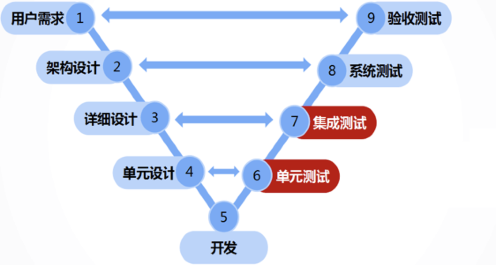
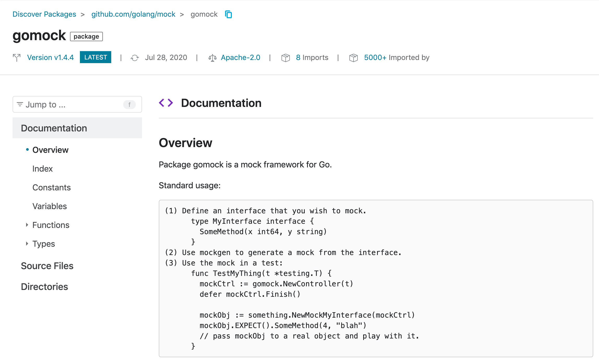

# Golang单元测试实践指南

## 一、基础

### 1.1 概念
单元测试是指对软件中最小可测试单元在于程序其他部分相隔离的情况下进行检查和校验。单元测试是白盒测试，通常由开发来完成，测试的对象可以是函数，也可以是类，而测试的目标是来检查程序是否按照预期的逻辑执行。好的单元测试会遵守 AIR 原则，以便让测试用例更加地复合规范。

### 1.2 AIR原则
AIR，即 Automatic（自动化）、Indepenndent（独立性）、Repleatable（可重复）的简写：
- 自动化：单元测试应该是自动执行，自动校验，自动给出结果，若需要人工检查（如将结果输出到控制台）的单元测试，不是好的单元测试；
- 独立性：单元测试应该是可以独立运行的，测试用例之间无依赖和执行次序，用例内部对外部资源也无依赖；
- 可重复：单元测试应该是可以重复执行的，每次的结果都是稳定可靠的；

我们在对软件进行测试的时候很容易混淆单元测试的概念，如果存在以下问题，那么你写的很可能不是单元测试：

- 是否能一键运行写过的所有测试用例？
- 两周前写的单元测试现在是否能正常运行？
- 自己写的单元测试在同事电脑里是否能正常运行？

你可能会有疑问，如果说不能，那做的都是些什么测试呢？实际上你做的是集成测试。

### 1.3 集成测试

集成测试的测试对象是整个系统或者某个功能模块，比如测试用户注册、登录功能是否正常，是一种端到端的测试。如果测试用例使用到真实的系统时间、真实的文件系统、真实的数据库，亦或者是其他真实的外部依赖，那么该测试已经进入到了集成测试的领域。



对集成测试以及后续的其他测试，本节不做过多展开，有兴趣的同学可以自行学习。

### 1.4 价值意义

那么我们花这么大力气引入单元测试能解决什么痛点，带来什么价值呢？

在笔者看来，单元测试可以带来代码质量提升、低成本确认问题、缩短上线流程等提高人效的价值，毕竟研发事无巨细地检查每一个功能，也不如程序自动完成来得全面和准确。另外减少低级错误导致测试人员与研发人员之间的信任问题，也可以让测试投出更多宝贵的时间参与到产品讨论和需求评审。

#### 1.4.1 提升代码质量
好的代码，可测性是一个衡量的标准，不好测试的代码，其本身的抽象性、模块性、可维护性都可能存在问题。例如不符合单一职责、接口隔离等设计原则，或者依赖了全局，而可测试的代码，往往其质量相对会高一些。

我们来个反面例子看看不好测的伪代码长啥样：

```golang
type IUserDao interface {
  QueryUserFromDB(name string) User
}

type Service struct {}

func (s *Service) QueryUser(name string) {
  // 创建接口 IUserDao 的实现
  userDao := NewUserDao()
  // 调用方法获得结果并进行后续操作
  userDao.QueryUserFromDB(name)
  ....
}
```

这种依赖关系是强耦合的代码，你在对它进行单元测试的时候会发现，即使你将接口 IUserDao 的模拟对象（mock）创建出来，也没有办法将 mock 对象放入 QueryUser 进行替换。反过来，如果你的单元测试很容易编写，测试性好，也能说明代码质量相对较高。

#### 1.4.2 低成本确认问题
单元测试最大的价值在于它们的反馈的速度，越早发现缺陷修复成本越低，而且业务迭代和代码重构的过程中单元测试可以确保代码的正确性，降低各种修改和重构的风险，也能让后续的集成测试和验收测试更容易通过。


### 1.5 入门示例

笔者用个非常简单的示例带大家入门，假设我们存在一个负责计算两数总和的 Add 函数：

```golang
// main.go
package main

func Add (num1, num2 int) int {
  return num1 + num2
} 
```

现在我们给它完善单元测试，先构建参数、然后调用函数、最后断言结果：

```golang
// main_test.go
package main

import (
	"testing"

	"github.com/stretchr/testify/assert"
)

func TestAdd(t *testing.T) {
  // 构建
  mockNum1 := 1
  mockNum2 := 2
  mockExpected := 3

  // 调用
  sum := Add(mockNum1, mockNum2)

  // 断言
	assert.Equal(t, mockExpected , sum)
}
```

我们在终端项目下运行 `go test -v` 就可以看到测试结果：
```text
=== RUN   TestAdd
--- PASS: TestAdd (0.00s)
PASS
ok      unittest 0.013s
```

练习完以上示例你就已经完成入门了，但接下来需要掌握更多的技巧，包括懂得识别依赖、明白如何破除依赖、掌握好用的测试框架再加上适当的编程技巧等，才能写出优秀的贴合实战的单元测试。

## 二、进阶

### 2.1 识别依赖
在实际的项目中，我们的测试单元很可能存在对外部的依赖，而单元测试的 Indepenndent 原则要求测试用例应该要独立运行的，即我们只需要保证被测试的单元内部逻辑正确即可，不需要真正依赖外部资源，因此我们需要做的第一件事情就是识别依赖。

常见的外部依赖项包括：文件I/O操作，如配置文件的读写；网络I/O，如外部HTTP接口调用、RPC调用、对数据库或者消息队列等资源的请求；又或者可以系统时间，项目中没有开发完成的模块等等。

在识别依赖后，就应该考虑怎么破除外部依赖。

### 2.2. 破除依赖
常用的破除依赖的方法包括：间谍（spy）、存根（stub，也成为打桩）、模拟对象（mock）和伪对象（fake）等：
- spy: 
- stub:
- mock:
- fake:

在 Golang 中我们并不需要自己花太多精力来构造这些破除依赖的资源，通过学习测试框架可以帮助我们快速地生成常用的 stub 和 mock 等资源。

### 2.3 测试框架
这里笔者推荐几个好用的测试框架获工具，包括 gomock、monkey 和 stretchr/testify等。

#### 2.3.1 gomock
`gomock`是 Golang 官方的维护的测试框架，可以对基于接口的模块提供很好的 mock 支持，通过它的概述我们可以快速了解到它的使用方式：


1. 第一步：逻辑代码中定义好你需要接口；
2. 第二步：使用 gomock 的 mockgen 工具生成 mock 文件；
3. 第三步：引入 mock 文件，对方法进行打桩并断言后续逻辑；

更多详情可以访问它的[使用文档](https://pkg.go.dev/github.com/golang/mock/gomock)和[代码仓库](https://github.com/golang/mock)。

#### 2.3.2 monkey
`monkey`框架通过在运行时重写执行文件来实现 stub 操作，该库存很久没有更新了且当前已经处于归档状态，但使用起来真的很方便，详情可以参考它的[代码仓库](https://github.com/bouk/monkey)。


#### 2.3.3 stretchr/testify

`stretchr/testify`可以提供打印友好、易于阅读的的断言（assert）包，详情可以参考它的[代码仓库](https://github.com/stretchr/testify)。

### 2.4 编码技巧
最后，如果一段代码我们很难为其编写单元测试，或者需要使用单元测试框架中很高级的特性，那往往意味着代码的设计存在问题。在这里笔记一般建议大家先掌握两个技巧：面向接口而非实现编程以及依赖注入。

#### 2.4.1 面向接口而非实现编程

先谈一下对接口的理解：接口是对行为的一种抽象，相当于一组协议或者契约，表示 has-a 的关系，它是一种自上而下的设计思路，先设计接口，再考虑代码实现，解决的是解耦问题。将接口和实现分离，可以封装不稳定的实现，暴露稳定的接口，上游系统面向接口而非实现编程，这样即使实现发生变化的时候，调用方也基本不需要改动，以此来降低耦合和提高扩展性。

在 Golang 语言中，对于任何数据类型，只要它的方法集合中包含了一个接口的全部方法，那么这个类型就是对这个接口的实现（即鸭子类型）。利用基于接口而非实现编程的设计思想，我们可以通过代理类实现和原始类相同的接口，再将原始类进行替换（静态代理），从而实现 mock 的行为。我们来个简单例子说明：

```golang
// 定义接口
type IUserDao interface {
  QueryUserFromDB(name string) User
}

// 原始实现 UserDao
type UserDao struct{}

func NewUserDao() IUserDao {
  return UserDao{}
}

func (UserDao) QueryUserFromDB(name string) User {
  // do something in user dao
  return User{}
}

// 代理实现 UserDaoMock
type UserDaoMock struct {}

func NewUserDaoMock() IUserDao {
  return UserDaoMock {}
}

func (NewUserDaoMock) QueryUserFromDB(name string) User {
  // do somethong in user dao mock 
  return User{}
}
```

上层在使用时只关心抽象接口 IUserDao，而不是具体实现 UserDao，这样我们的单元测试就可以很轻松地使用 UserDaoMock 对象完成对 UserDao 的 mock 动作，进而开展后续的操作。


#### 2.4.2 依赖注入
依赖注入指的是不通过显式创建的方式（new）在类内部创建依赖类的对象，而是将依赖的对象在外部创建好之后，通过构造函数、函数传参等方式传递给类使用。在没有使用依赖注入框架的情况下，可以这样在 Golang 中实现依赖注入：

```golang
type UserService struct {
  userDao IUserDao
}

func NewUserService (userDao IUserDao) {
  return UserService{ userDao: userDao }
}

func (s *Service) Query(name string) {
  s.userDao.QueryUserFromDB(name)
}

// 调用方
func main () {
  userService := NewUserService(NewUserDao())
}
```

或者你的`NewUserService`方法可以写得更简单一点：
```golang
func NewUserService () {
  return UserService{ userDao: NewUserDao()}
}
```

使用依赖注入而不是显式创建依赖，是编写出可测性良好代码的关键一步，后续的实践过程我们将继续探讨这个过程。


## 三、实践
说这么多，我们看看到底应该怎么做吧。现在假设我们存在一组 CRUD 的接口按照常规 MVC 分层，伪代码如下：

入口文件，主要是负责初始化路由：

<details>

```golang
package main

import (
  "net/http"
  "time"

  "github.com/gin-gonic/gin"
  "github.com/zhulinwei/go-dc/pkg/config"
  "github.com/zhulinwei/go-dc/pkg/router"
  "github.com/zhulinwei/go-dc/pkg/util/log"
)

func main() {
  route := gin.New()
  router.InitRoute(route)
  server := &http.Server{
    // 监听的TCP地址
    Addr: config.ServerConfig().HttpPort,
    // http句柄，用于处理程序响应的HTTP请求
    Handler: route,
    // 等待的最大时间
    IdleTimeout: 6 * time.Minute,
    // 允许读取的最大时间
    ReadTimeout: 30 * time.Second,
    // 允许写入的最大时间
    WriteTimeout: 30 * time.Second,
    // 请求头的最大字节数
    MaxHeaderBytes: 1 << 20,
  }
  if err := server.ListenAndServe(); err != nil {
    log.Error("server run failed", log.String("err", err.Error()))
  }
}
```
</details>

路由文件，负责注册路由和分发任务：
<details>

```golang
package router

import (
  "github.com/gin-gonic/gin"
  "github.com/zhulinwei/go-dc/pkg/controller"
)

type IUserRouter interface {
  InitRouter(r *gin.Engine)
}

type UserRouter struct {
  UserController controller.IUserController
}

func BuildUserRouter() IUserRouter {
  return UserRouter{
    UserController: controller.BuildUserController(),
  }
}

func (userRouter UserRouter) InitRouter(r *gin.Engine) {
  route := r.Group("/api")

  route.POST("/v1/users", userRouter.UserController.SaveUser)
  route.GET("/v1/users/:name", userRouter.UserController.QueryUserByName)
  route.PUT("/v1/users/:name", userRouter.UserController.UpdateUserByName)
  route.DELETE("/v1/users/:name", userRouter.UserController.RemoveUserByName)
}
```
</details>

控制层文件，负责常规的参数校验和结果响应：

<details>

```golang
package controller

import (
  "net/http"

  "github.com/zhulinwei/go-dc/pkg/util"

  "github.com/gin-gonic/gin"
  "github.com/zhulinwei/go-dc/pkg/model"
  "github.com/zhulinwei/go-dc/pkg/service"
  "github.com/zhulinwei/go-dc/pkg/util/log"
)

type IUserController interface {
  SaveUser(ctx *gin.Context)
  QueryUserByName(ctx *gin.Context)
  UpdateUserByName(ctx *gin.Context)
  RemoveUserByName(ctx *gin.Context)
}

type UserController struct {
  userService service.IUserService
}

func BuildUserController() IUserController {
  return UserController{
    userService: service.BuildUserService(),
  }
}

// Create
func (ctrl UserController) SaveUser(ctx *gin.Context) {
  // 解析前端数据
  var user model.UserRequest
  if err := ctx.ShouldBind(&user); err != nil {
    log.Error("gin bind user error", log.String("error", err.Error()))
    ctx.JSON(http.StatusBadRequest, model.Response{Code: -1, Msg: util.ParserErrorMsg(err)})
    return
  }
  // 调用服务层逻辑
  saveID := ctrl.userService.SaveUser(user)
  // 返回处理结果
  ctx.JSON(http.StatusOK, model.Response{Code: 0, Msg: "success", Data: gin.H{"id": saveID}})
}

// Read
func (ctrl UserController) QueryUserByName(ctx *gin.Context) {
  name := ctx.Param("name")
  // 可以进一步判断user是否为nil值
  user, err := ctrl.userService.QueryUserByName(name)
  if err != nil {
    log.Error("query user fail", log.String("error", err.Error()))
    ctx.JSON(http.StatusInternalServerError, nil)
    return
  }
  ctx.JSON(http.StatusOK, model.Response{Code: 0, Msg: "success", Data: user})
}

// Update
func (ctrl UserController) UpdateUserByName(ctx *gin.Context) {}

// Delete
func (ctrl UserController) RemoveUserByName(ctx *gin.Context) {}
```
</details>

服务层文件，处理控制文件传入的数据并进行业务处理：

<details>

```golang
package service

import (
  "github.com/zhulinwei/go-dc/pkg/cache"
  "github.com/zhulinwei/go-dc/pkg/dao"
  "github.com/zhulinwei/go-dc/pkg/model"
)

type IUserService interface {
  SaveUser(user model.UserRequest) interface{}
  QueryUserByName(name string) (*model.UserDB, error)
}

type UserService struct {
  UserDao dao.IUserDao
}

func BuildUserService() IUserService {
  return UserService{
    UserDao: dao.BuildUserDao(),
  }
}

// Save user
func (service UserService) SaveUser(user model.UserRequest) interface{} {
  if result, err := service.UserDao.SaveUser(user); err != nil {
    return nil
  } else {
    return result.InsertedID
  }
}

// Query User
func (service UserService) QueryUserByName(name string) (*model.UserDB, error) {
  return service.UserDao.QueryUserByName(name)
}
```

</details>

好吧，这个服务层文件的逻辑比较简单，我们看看怎么对它的 SaveUser 方法进行单元测试。

首先是识别依赖，在这里我们只需要根据 SaveUser 方法的输入来测试它的输出值是否复合我们的预期即可，而它里面调用的 Dao 操作就是它的外部依赖；接着我们需要对这个 Dao 操作进行打桩和 mock 处理，即直接假设 Dao 能返回我们所需的结果，或者假设 Dao 会抛出 err，然后来判断我们的 SaveUser 方法逻辑是否能复合预期。

我们使用 Golang 的官方测试框架`gomock`来进行打桩和 mock。

下载gomock：
```shell
go get -u github.com/golang/mock/gomock
go get -u github.com/golang/mock/mockgen
```

使用 gomock 的脚手架工具 mockgen 生成 Dao 文件对应的 Mock 文件：
```shell   
mockgen -destination pkg/dao/mock/user_mock.go -source pkg/dao/user.go
```

针对 SaveUser 方法编写单元测试：
<details>

```golang
package service

import (
  "testing"

  "github.com/golang/mock/gomock"
  "github.com/stretchr/testify/assert"
  mockDao "github.com/zhulinwei/go-dc/pkg/dao/mock"
  "github.com/zhulinwei/go-dc/pkg/model"
  "go.mongodb.org/mongo-driver/bson/primitive"
  "go.mongodb.org/mongo-driver/mongo"
)

func TestUserService_SaveUser(t *testing.T) {
  // mock data
  mockTest := model.UserRequest{Age: 18, Name: "tony"}
  mockObjectId := primitive.NewObjectID()

  // mock request
  mockCtrl := gomock.NewController(t)
  defer mockCtrl.Finish()
   mockUserDao := mockDao.NewMockIUserDao(mockCtrl)
   // 对 UserDao 的 SaveUser 方法进行打桩，使其可以返回预期结果
   mockUserDao.EXPECT().SaveUser(mockTest).Return(&mongo.InsertOneResult{InsertedID: mockObjectId})
   // 将 mockUserDao 注入到 UserService 中，以替换原始 UserDao 逻辑
  mockUserService := UserService{
  	UserDao: mockUserDao,
  }
  realResult := mockUserService.SaveUser(mockTest)

  // assert result
  assert.Equal(t, mockObjectId, realResult)
}
```
</details>

针对控制层文件的逻辑我们也是一样的处理思路，以 QueryUserByName 方法为例：方法内部调用的 Service 操作就是它的依赖，要对依赖进行打桩和 mock 处理，然后测试 QueryUserByName 方法能否正确校验参数和返回对应的结果或响应码。

使用 gomock 的脚手架工具 mockgen 生成 Service 文件对应的 Mock 文件：
```shell   
mockgen -destination pkg/service/mock/user_mock.go -source pkg/service/user.go
```

控制层的单元测试会相对麻烦一点，因为我们需要启动一个测试用的 HTTP Server 来响应我们的请求。避免使用真实项目中的 HTTP Server 的原因在于它会带来不必要的依赖项，而 mock 掉 HTTP Server 会方便我们的测试进行。针对 QueryUserByName 方法编写单元测试如下：

<details>

```golang
package controller

import (
  "encoding/json"
  "io/ioutil"
  "net/http/httptest"
  "testing"

  "github.com/gin-gonic/gin"
  "github.com/golang/mock/gomock"
  "github.com/stretchr/testify/assert"
  "github.com/zhulinwei/go-dc/pkg/model"
  mockService "github.com/zhulinwei/go-dc/pkg/service/mock"
  "go.mongodb.org/mongo-driver/bson/primitive"
)

func TestUserController_QueryUserByName(t *testing.T) {
  //mock data
  const mockUrl = "/:name"
  const mockName = "tony"
  const mockMethod = "GET"
  mockObjectId := primitive.NewObjectID()
  
  // mock request
  route := gin.Default()
  
  mockCtrl := gomock.NewController(t)
  defer mockCtrl.Finish()
  
  mockUserService := mockService.NewMockIUserService(mockCtrl)
  mockUserService.EXPECT().QueryUserByName(mockName).Return(&model.UserDB{ID: mockObjectId, Age: 18, Name: mockName})
  
  mockUserController := UserController{
  	userService: mockUserService,
  }
  route.GET(mockUrl, mockUserController.QueryUserByName)
  request := httptest.NewRequest(mockMethod, "/tony", nil)
  recorder := httptest.NewRecorder()
  route.ServeHTTP(recorder, request)
  
  body, err := ioutil.ReadAll(recorder.Result().Body)
  assert.NoError(t, err)
  
  var result model.UserDB
  err = json.Unmarshal(body, &result)
  assert.NoError(t, err)
  
  // assert result
  assert.NoError(t, err)
  assert.Equal(t, result.Name, mockName)
}
```
</details>

更多详情可以参考笔者的[练习项目](https://github.com/zhulinwei/go-dc)

## 四、思考

至此，希望以上知识能帮助你更好地掌握到如何在 Golang 中使用单元测试。同时相信你也会发现，引入单元测试后必不可少地增加了维护成本，笔者也留下几个思考题，欢迎留言评论：

1. 单元测试的粒度到底要做到多细？
2. 单元测试的成本和受益如何平衡？
3. 业界崇尚的TDD是否为最佳实践？