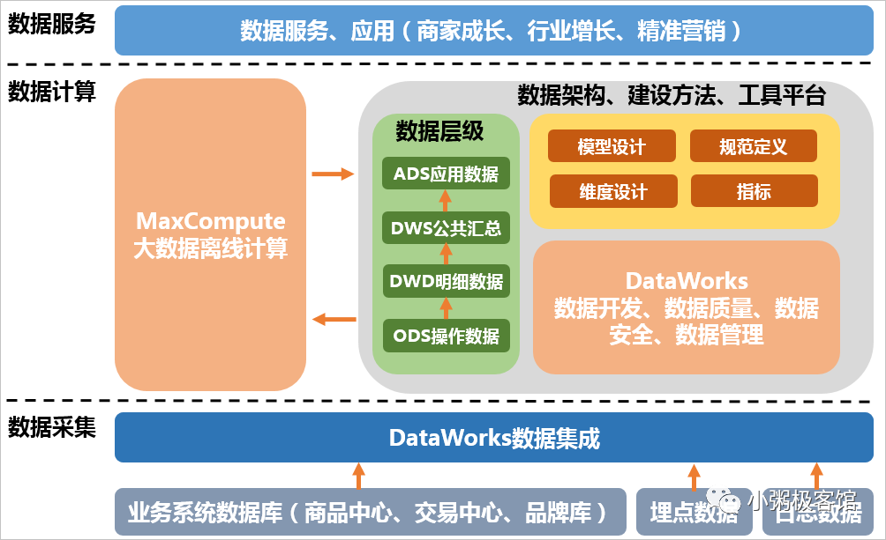
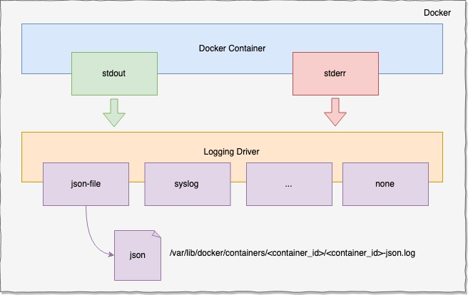
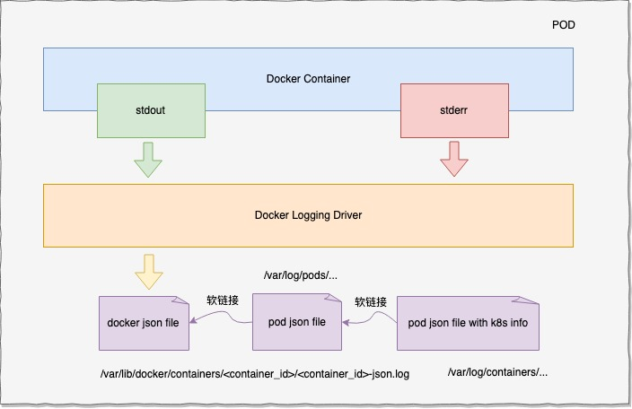
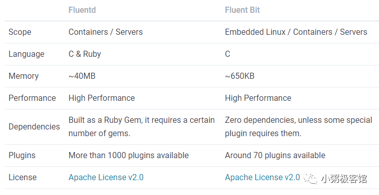
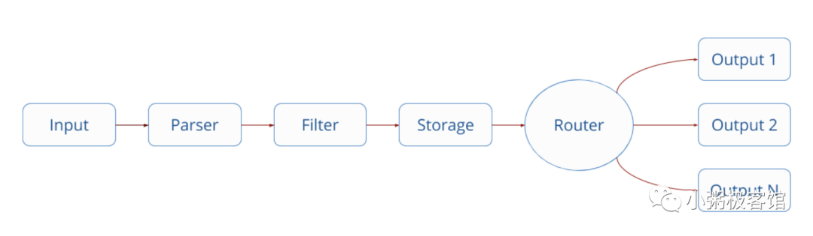
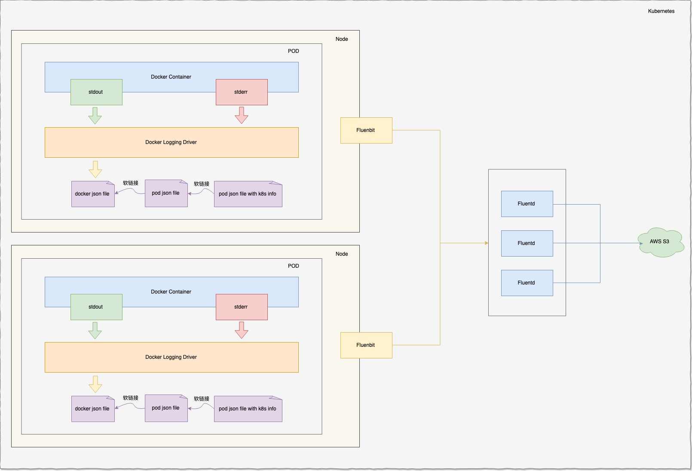

# ​基于Kubernetes实现的大数据采集与存储实践总结

## 一、前言

近来我司部门内部搭建的电商大数据平台一期工程进入了尾声工作，不仅在技术上短期内从零到一搭建起属于团队的大数据平台，而且在业务上可以满足多方诉求。笔者很有幸参与到其中的建设，在给优秀的团队成员点赞的同时，也抽空整理了一下文档，那么今天就和大家来聊一下我们是如何结合 Kubernetes 实现数据采集与存储的，谈谈里面实现方案、原理和过程。这里笔者放一张我们前期设计时借鉴阿里的大数据架构图：


本文重点讲述的是上图中『数据采集』部分，暂不涉及『数据计算』和『数据服务』的过程。在数据采集中，我们通过运行在Kubernetes中的清洗服务，不断地消费Kafka中由定时任务爬取的业务数据，并通过Fluentbit、Fluentd等日志采集工具对容器中打印到标准输出的数据压缩存储至AWS S3中。如果你对这块有兴趣的话，那就一起开始今天的内容吧。


## 二、基础篇

### 2.1 Docker日志管理

我们的应用服务都运行在 Docker 容器中，Docker 的日志有两种：dockerd 运行时的引擎日志和容器内服务产生的容器日志。在这里我们不用关心引擎日志，容器日志是指到达标准输出（stdout）和标准错误输出（stderr）的日志，其他来源的日志不归 Docker 管理，而 Docker 将所有容器打到 stdout 和 stderr 的日志通过日志驱动统一重定向到某个地方。Docker 支持的日志驱动有很多，比如 local、json-file、syslog、journald 等等，不同的日志驱动可以将日志重定向到不同的地方。Docker 以热插拔的方式实现日志不同目的地的输出，体现了管理的灵活性。其中默认的日志驱动是 json-file，该驱动将日志以 json 的形式重定向存储到本地磁盘，其存储格式为：/var/lib/docker/containers/<container-id>/<container-id>-json.log。笔者画了一张简易的流转图：


官方支持的日志驱动很多，详情看可以自行查阅 [Docker Containers Logging](https://docs.docker.com/config/containers/logging/configure)。我们可以通过 docker info | grep Loggin 命令查看 Docker 的日志驱动配置，也可以通过 --log-driver 或者编写 /etc/docker/daemon.json 文件配置Docker容器的驱动：

```json
{
  "log-driver": "syslog"
}
```
本实践使用的是 Docker 默认驱动，即 json file，这里大家对 Docker 的日志流转有基本的认识即可。需要关注的是每种 Docker 日志驱动都有相应的配置项日志轮转，比如根据单个文件大小和日志文件数量配置轮转。json-file 日志驱动支持的配置选项如下：
- max-size：切割之前日志的最大大小，可取值单位为(k,m,g)， 默认为-1（表示无限制）；
- max-file：可以存在的最大日志文件数，如果切割日志会创建超过阈值的文件数，则会删除最旧的文件，仅在max-size设置时有效，默认为1；
- labels：适用于启动Docker守护程序时，此守护程序接受的以逗号分隔的与日志记录相关的标签列表；
- env：适用于启动Docker守护程序时，此守护程序接受的以逗号分隔的与日志记录相关的环境变量列表；
- compress：切割的日志是否进行压缩，默认是disabled；

详见：[json file 文档](https://docs.docker.com/config/containers/logging/json-file)

### 2.2 Kubernetes日志管理

在 Kubernetes中日志种类也分为两种：

在容器中运行kube-scheduler和kube-proxy；

不运行在容器中运行时的 kubelet 和容器运行时（如 Docker）；

在使用 systemd 机制的服务器上，kubelet 和容器运行时将日志写入到 journald；如果没有 systemd，他们将日志写到 /var/log 目录的 .log 文件中。容器中的系统组件通常将日志写到 /var/log 目录，在 kubeadm 安装的集群中它们以静态 Pod 的形式运行在集群中，因此日志一般在 /var/log/pods 目录下。

需要强调的一点是，对于应用 POD 日志 Kuberntes 并不管理日志的轮转策略，且日志的存储都是基于 Docker 的日志管理策略进行。在默认的日志驱动中，kubelet 会为每个容器的日志创建一个软链接，软链接存储路径为：/var/log/containers/，软链接会链接到 /var/log/pods/ 目录下相应 pod 目录的容器日志，被链接的日志文件也是软链接，最终链接到 Docker 容器引擎的日志存储目录：即/var/lib/docker/container 下相应容器的日志。这些软链接文件名称含有 k8s 相关信息，比如：Pod id，名字空间，容器 ID 等信息，这就为日志收集提供了很大的便利。简图如下：



### 三、进阶篇

在 Kubernetes 中比较流行的数据收集方案是 Elasticsearch、Fluentd 和 Kibana 技术栈，也是官方现在比较推荐的一种方案。我们在这里只使用到 EFK 技术栈中的 F，即 Fluentd 以及它的衍生品 Fluent Bit。Fluentd 和 Fluent Bit 都致力于收集、处理和交付日志数据。但是两个项目之间存在一些主要差异，使它们适合于不同的任务：

- Fluentd：旨在汇总来自多个输入的日志，对数据进行处理然后路由至不同的输出。它的引擎具有性能卓越的队列处理线程，可快速使用和路由大批日志。同时具有丰富的输入和输出插件生态系统（超过650个）;
- Fluent Bit：被设计为在高度受限的计算能力和减少的开销（内存和CPU）成为高度关注的分布式计算环境中运行，因此它非常的轻巧（KB级别）和高性能，适合做日志收集，处理和转发，但不适用于日志聚合；

我们用官方的一张图来对比它们的差异：



Fluend 和 FluenBit 都有着相似的数据流处理方式，包括 Input、Parse、Filter、Buffer、Routing 和 Ouput 等组件，官方图如下：


- Input: 提供了多种的输入插件用于收集不同来源的信息，如日志文件或者操作系统信息等；
- Parser: 解析器用来解析原始的字符串成结构化的信息（如json格式）；
- Filter: 过滤器用来在分发事件之前修改或者过滤事件；
- Buffer: 提供数据的缓存机制，优先使用内存，其次是文件系统；
- Router: 将不同分类的数据发送到不同的输出中，一般使用Tag和Match来实现；
- Output: 同样提供了不同的输出插件，包括远程服务，本地文件或者标准输出等；

### 四、架构篇

由容器引擎或 runtime 提供的原生功能通常不足以满足完整的日志记录需求，当发生容器崩溃、pod 被逐出或节点宕机等情况，如果仍然想访问到应用日志，那么日志就应该具有独立的存储和生命周期。我们利用容器化后的应用写入 stdout 和 stderr 的任何数据，都会被容器引擎捕获并被重定向到某个位置的特性，使用日志转发器 FluentBit 负责采集日志并将数据推送到日志聚合器 Fluentd 后，再由 Fluentd 负责聚合和存储数据至 AWS S3 中。由于日志转发器必须在每个节点上运行，因此它可以用 DaemonSet 副本，而日志聚合器则可以按需扩容缩容，因此我们使用 Deployment 来部署。笔者简单画的架构图如下：


### 五、实践篇

前面讲了一大推的基础理论和架构，终于到了实践的时候了，这里我们需要准备基本的实践环境，包括：

- 拥有DockerHub账号，用于存放Docker镜像；
- 拥有Kubernetes集群，用于编排容器和部署应用；

接下来笔者准备了三个服务的代码示例，包括负责接收和清洗业务数据的服务、采集日志并转发的 FluentBit 还有聚合数据并压缩存储的 Fluentd。

#### 5.1 清洗服务
我们使用 zap 作为日志库，不断进行打印数据以模拟清洗服务处理业务逻辑，编写的 Sample 代码如下：

```golang
package main

import (
  "time"

  "go.uber.org/zap"
)

func main() {
  logger, _ := zap.NewProduction()
  defer logger.Sync() // flushes buffer, if any
  sugar := logger.Sugar()

  for {
    sugar.Infow("just a example",
      "author", "tony",
      "today", time.Now().Format("2006-01-02 15:04:05"),
      "yesterday", time.Now().AddDate(0, 0, -1).Format("2006-01-02 15:04:05"),
    )
    time.Sleep(time.Duration(5) * time.Second)
  }
}
```
接着我们编写构建脚本，把它打包成镜像以供后续 Kubernetes 集群部署 deployment 使用，Dockerfile 如下：

```shell
# build stage
FROM golang:latest as builder
LABEL stage=gobuilder
WORKDIR /build
COPY . .
RUN CGO_ENABLED=0 GOOS=linux GOARCH=amd64 go build -ldflags="-w -s" -o example

# final stage
FROM scratch
COPY --from=builder /build/example /
EXPOSE 8080
ENTRYPOINT ["/example"]
```
执行以下命令完成构建并推上 docker hub上：

```shell
# build
docker build -t <your_docker_hub>/logging:latest . && docker image prune -f .
# push
docker push <your_docker_hub>/logging:latest
```
最后我们的代码部署在 Kubernetes 集群中，模拟运行我们的清洗服务：

```shell
apiVersion: apps/v1
kind: Deployment
metadata:
  name: example
  namespace: logging
  labels:
    app: example
spec:
  replicas: 1
  selector:
    matchLabels:
      app: example
  template:
    metadata:
      labels:
        app: example
    spec:
      containers:
      - name: example
        image: <your_docker_hub>/logging:latest
        resources:
          limits:
            cpu: 100m
            memory: 200Mi
          requests:
            cpu: 10m
            memory: 20Mi
        ports:
        - containerPort: 24224
      terminationGracePeriodSeconds: 30
```
详见：[logging example](https://github.com/zhulinwei/logging/tree/master/example)


#### 5.2 日志转发器 FluentBit

Fluent Bit 作为日志转发器需要负责数据的采集和转发，它需要的准备基本授权文件、项目配置以及 daemon 部署文件。

##### 授权文件

```yaml
# fluentbit_rbac.yaml
apiVersion: rbac.authorization.k8s.io/v1beta1
kind: ClusterRole
metadata:
  name: fluentbit-read
rules:
- apiGroups: [""]
  resources:
  - namespaces
  - pods
  verbs: ["get", "list", "watch"]
---
apiVersion: rbac.authorization.k8s.io/v1beta1
kind: ClusterRoleBinding
metadata:
  name: fluentbit-read
roleRef:
  apiGroup: rbac.authorization.k8s.io
  kind: ClusterRole
  name: fluentbit-read
subjects:
- kind: ServiceAccount
  name: fluentbit
  namespace: logging
```

##### 项目配置

```yaml
kind: ConfigMap
metadata:
  name: fluentbit-config
  namespace: logging
apiVersion: v1
data:
  fluent-bit.conf: |-
    [SERVICE]
        Flush          1
        Daemon         Off
        Log_Level      info
        Parsers_File   parsers.conf
        HTTP_Server   On
        HTTP_Listen   0.0.0.0
        HTTP_Port     2020
    [INPUT]
        Name           tail
        Tag            kube.*
        # Path           /var/log/containers/*.log
        Path           /var/log/containers/*logging_example*.log
        Parser         docker
        DB             /var/log/flb_kube.db
        Mem_Buf_Limit  5MB
        Skip_Long_Lines   On
        Refresh_Interval  10
        Ignore_Older      24h
    [FILTER]
        Name                kubernetes
        Match               kube.*
        Kube_URL            https://kubernetes.default.svc:443
        Kube_CA_File        /var/run/secrets/kubernetes.io/serviceaccount/ca.crt
        Kube_Token_File     /var/run/secrets/kubernetes.io/serviceaccount/token
        Kube_Tag_Prefix     kube.var.log.containers.
        Merge_Log           On
        Merge_Log_Key       log_processed
        K8S-Logging.Parser  On
        K8S-Logging.Exclude Off
    [OUTPUT]
        Name            forward
        Match           *
        Host            ${FLUENTD_HOST}
        Port            ${FLUENTD_PORT}
        Time_as_Integer True
  parsers.conf: |-
    [PARSER]
        Name   apache
        Format regex
        Regex  ^(?<host>[^ ]*) [^ ]* (?<user>[^ ]*) \[(?<time>[^\]]*)\] "(?<method>\S+)(?: +(?<path>[^\"]*?)(?: +\S*)?)?" (?<code>[^ ]*) (?<size>[^ ]*)(?: "(?<referer>[^\"]*)" "(?<agent>[^\"]*)")?$
        Time_Key time
        Time_Format %d/%b/%Y:%H:%M:%S %z
    [PARSER]
        Name   apache2
        Format regex
        Regex  ^(?<host>[^ ]*) [^ ]* (?<user>[^ ]*) \[(?<time>[^\]]*)\] "(?<method>\S+)(?: +(?<path>[^ ]*) +\S*)?" (?<code>[^ ]*) (?<size>[^ ]*)(?: "(?<referer>[^\"]*)" "(?<agent>[^\"]*)")?$
        Time_Key time
        Time_Format %d/%b/%Y:%H:%M:%S %z
    [PARSER]
        Name   apache_error
        Format regex
        Regex  ^\[[^ ]* (?<time>[^\]]*)\] \[(?<level>[^\]]*)\](?: \[pid (?<pid>[^\]]*)\])?( \[client (?<client>[^\]]*)\])? (?<message>.*)$
    [PARSER]
        Name   nginx
        Format regex
        Regex ^(?<remote>[^ ]*) (?<host>[^ ]*) (?<user>[^ ]*) \[(?<time>[^\]]*)\] "(?<method>\S+)(?: +(?<path>[^\"]*?)(?: +\S*)?)?" (?<code>[^ ]*) (?<size>[^ ]*)(?: "(?<referer>[^\"]*)" "(?<agent>[^\"]*)")?$
        Time_Key time
        Time_Format %d/%b/%Y:%H:%M:%S %z
    [PARSER]
        Name   json-test
        Format json
        Time_Key time
        Time_Format %d/%b/%Y:%H:%M:%S %z
    [PARSER]
        Name        docker
        Format      json
        Time_Key    time
        Time_Format %Y-%m-%dT%H:%M:%S.%L
        Time_Keep   On
    [PARSER]
        Name        syslog
        Format      regex
        Regex       ^\<(?<pri>[0-9]+)\>(?<time>[^ ]* {1,2}[^ ]* [^ ]*) (?<host>[^ ]*) (?<ident>[a-zA-Z0-9_\/\.\-]*)(?:\[(?<pid>[0-9]+)\])?(?:[^\:]*\:)? *(?<message>.*)$
        Time_Key    time
        Time_Format %b %d %H:%M:%S
```
##### 部署文件

```yaml
apiVersion: apps/v1
kind: DaemonSet
metadata:
  name: fluentbit
  namespace: logging
  labels:
    k8s-app: fluentbit-logging
    version: v1
    kubernetes.io/cluster-service: "true"
spec:
  selector:
    matchLabels:
      k8s-app: fluentbit-logging
      version: v1
  template:
    metadata:
      labels:
        k8s-app: fluentbit-logging
        version: v1
        kubernetes.io/cluster-service: "true"
    spec:
      containers:
      - name: fluentbit
        image: fluent/fluent-bit:1.2.1
        env:
          - name: FLUENTD_HOST
            value: "fluentd"
          - name: FLUENTD_PORT
            value: "24224"
        resources:
          limits:
            memory: 100Mi
          requests:
            cpu: 100m
            memory: 100Mi
        volumeMounts:
        - name: config
          mountPath: /fluent-bit/etc
        - name: varlog
          mountPath: /var/log
        - name: varlibdockercontainers
          mountPath: /var/lib/docker/containers
          readOnly: true
        - name: minikube
          mountPath: /mnt/sda1/var/lib/docker/containers
          readOnly: true
      terminationGracePeriodSeconds: 10
      volumes:
      - name: config
        configMap:
          name: fluentbit-config
      - name: varlog
        hostPath:
          path: /var/log
      - name: varlibdockercontainers
        hostPath:
          path: /var/lib/docker/containers
      - name: minikube
        hostPath:
          path: /mnt/sda1/var/lib/docker/containers
```

#### 5.3 日志聚合器 Fluentd

Fluentd 作为日志聚合器负责数据的聚合来自 FluentBit 的数据，并将其存储到 AWS S3中，需要准备项目配置以及 deployment 文件。

##### 项目配置

```yaml
kind: ConfigMap
apiVersion: v1
metadata:
  name: fluentd-config
  namespace: logging
data:
  fluent.conf: |-
    <system>
      log_level debug
    </system>

    <source>
      @type http
      port 9880
      bind 0.0.0.0
      body_size_limit 32m
      keepalive_timeout 10s
    </source>
    <source>
      @type forward
      port 24224
      bind 0.0.0.0
      tag kube.forward
    </source>
    <match **>
      @type s3
path "year=%Y/month=%m/day=%d/hour=%H"
      s3_bucket <your_s3_bucket>
      s3_region <your_s3_region>
    </match>
```
##### 部署文件

```yaml
apiVersion: v1
kind: Service
metadata:
  name: fluentd
  namespace: logging
  labels:
    app: fluentd
spec:
  ports:
  - name: http
    port: 9880
    protocol: TCP
  - name: forword
    port: 24224
    protocol: TCP
  selector:
    app: fluentd
  type: NodePort
---
apiVersion: apps/v1
kind: Deployment
metadata:
  name: fluentd
  namespace: logging
  labels:
    app: fluentd
spec:
  replicas: 1
  selector:
    matchLabels:
      app: fluentd
  strategy:
    rollingUpdate:
      maxSurge: 25%
      maxUnavailable: 25%
    type: RollingUpdate
  template:
    metadata:
      labels:
        app: fluentd
    spec:
      containers:
      - name: fluentd
        image: ghgt/fluentd-es-s3-rewrite:v1.7.3-alpine-es7-s3-rewrite-1.1
        env:
        - name: FLUENTD_ARGS
          value: --no-supervisor -q
        resources:
          limits:
            memory: 500Mi
          requests:
            cpu: 100m
            memory: 200Mi
        ports:
        - containerPort: 8080
        - containerPort: 24224
        volumeMounts:
        - name: varlog
          mountPath: /var/log
        - name: config-volume
          mountPath: /fluentd/etc
      terminationGracePeriodSeconds: 30
      volumes:
      - name: varlog
        hostPath:
          path: /var/log
      - name: config-volume
        configMap:
          name: fluentd-config
```

到此，编码完成！启动并在集群中运行三个服务，随后检查你的 AWS S3 存储桶吧！


## 总结

写到最后，相信你已经了解如何使用 FluentBit、Fluentd 等工具结合 Kubernetes 实现对大数据的采集和存储流程，笔者从基础原理到方案架构，再到实践过程，通过简单的Sample 示例带领大家领悟企业级的项目实现，希望读完文章的你有所收获。在接下来的文章中，笔者将继续带领大家关注云原生领域的知识，敬请期待~

