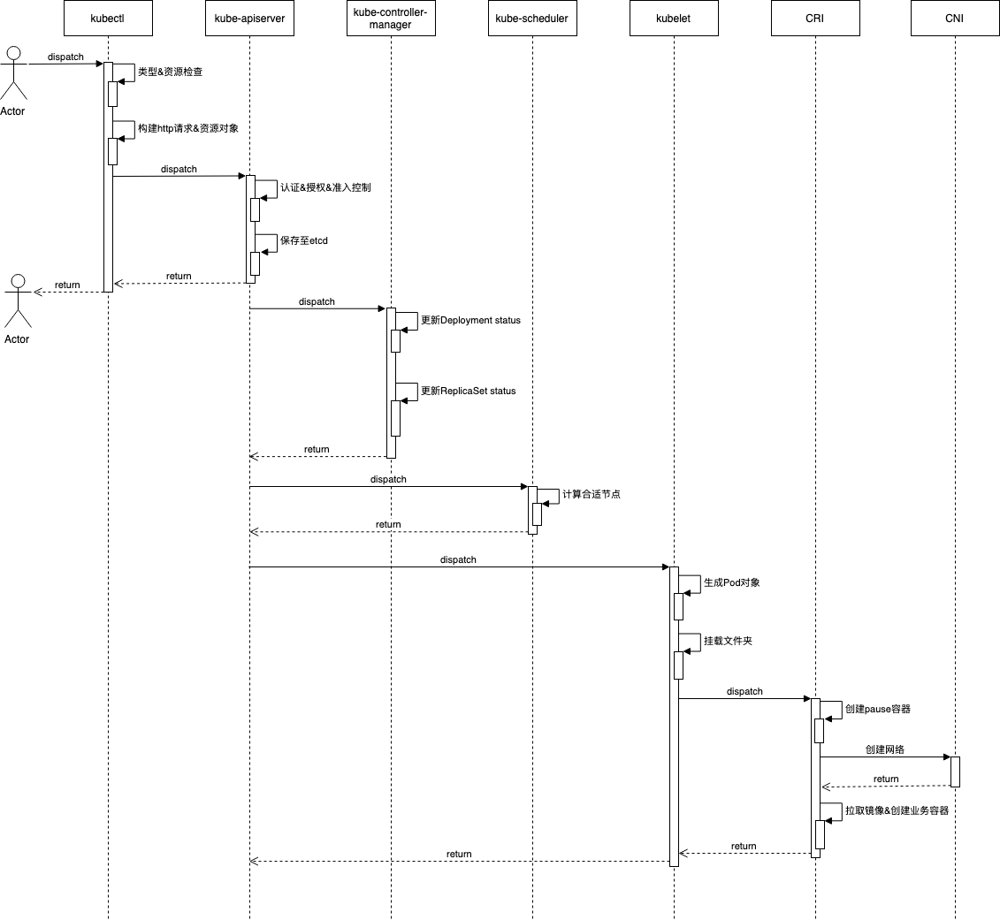

# 从Pod的创建过程谈谈Kubernetes的整体架构

## 序言

Pod是Kubernetes集群中能够被创建和管理的最小部署单元，本文通过讲解Pod的创建过程和实现原理，来探探Kubernetes的整体架构。我们先通过Yaml文件来展示Pod的定义：
```yaml
# pod.yaml
apiVersion: v1          # KubernetesAPI版本
kind: Pod               # Kubernetes资源类型
metadata:               # 元数据描述
  name: name            # 指定Pod的名称
  namespace: default    # 指定Pod运行的命名空间
  labels:               # 指定pod标签
    app: pod_label
  annotations:          # 指定Pod的注释
    version: v0.0.1
spec:                   # 规范，用于描述对象的详细配置
  containers:
  - name: c1            # 容器的名称
    image: nginx        # 创建容器所使用的镜像
    ports:
    - containerPort: 80 # 应用监听的端口
  - name: c2            # 容器的名称
    image: busybox      # 创建容器所使用的镜像
    command:            # 容器启动命令
      - "bin/sh"
      - "-c"
      - "sleep 100"
```
执行以下命令：
```
kubectl create -f pod.yaml
```
稍等片刻我们可以通过执行命令`kebectl get pods`便可看到以下结果：
```
NAME                      READY     STATUS    RESTARTS   AGE
name                  2/2       Running   0          1s
```
那从`kubectl create`被执行，到`Pod`的创建完成，这中间件到底发生了什么呢？整个生命周期在流转的过程中经过了哪些组件？让我们从`kubectl`说起...

## kubectl
kubectl 是 Kubernetes 集群的命令行工具，当我们执行`kubectl create`命令的时候，kubectl 会进行基本的参数校验操作，包括对创建资源的检查或者创建文本的格式等内容进行校验，随后获取用户的身份信息。在类Unix系统中我们可以在`~/.kube/config`找到 kubectl 的配置文件，这个配置文件被称为kubeconfig。kubectl 使用 kubeconfig 来组织集群、用户、命名空间和身份认证等信息。当然我们也可以通过设置环境变量`KUBECONFIG`或者使用 kubectl 时带上参数`--kubeconfig`来指定其他的配置文件，且kubectl识别kubeconfig的顺序依次为：`--kubeconfig`、`KUBECONFIG`、`~/.kube/config`。

我们来看一下kebuconfig文件的内容：

```yaml
apiVersion: v1
clusters:
- cluster:              # 集群信息
    certificate-authority-data: LS0tLS1CRUdJ
    server: https://127.0.0.1:34083
  name: zlw
contexts:               # 上下文
- context:
    cluster: zlw
    user: kubernetes-admin
  name: kubernetes-admin@zlw
current-context: kubernetes-admin@zlw
kind: Config
preferences: {}
users:                  # 用户信息
- name: kubernetes-admin
  user:
    client-certificate-data: LS0tLS1CRUdJ
```
由此可以看出，kubeconfig 中有三个关键的字段：集群信息、上下文和用户信息。

kubectl 会根据当前上下文确定要操作的集群以及提供用户的身份认证信息，并把这些内容塞到 HTTP 的请求头中向 kube-apiserver 发起请求，开始进行 Pod 的创建过程。

## kube-apiserver

kube-apiserver 负责为 Kubernetes 提供 RESTful 风格的 API，以供其他组件变更集群的资源信息，并对请求进行认证、鉴权和准入控制等安全校验功能，而我们 Pod 的创建过程也需要经过这三个过程。

### 认证

认证是身份校验，解决『你是谁』的问题。Kubernetes 虽然会使用到用户信息，但它本身并不直接管理用户，也没提供创建和存储用户的设计，而是直接与第三方用户权限平台进行对接。在 Kubernetes 中常使用 x509 证书、Token等方式进行身份校验，Token 可以是用户自己提供的静态 Token，也可以是 ServiceAccount Token、Bootstrap Token、OIDC Token、Webhook Token等，只要在 HTTP 请求的 Header 中添加 Authorization 字段，值为 Bearer + <Token> 即可。

如果认证成功，就进入后续的授权过程。

### 授权

授权负责做权限控制，解决『你能做什么』的问题。请求在经过认证后，可以证明请求是合法的，但是并不能证明请求是有权限进行操作的，因此 kube-apiserver 还需要对请求进行授权检查。

Kubernetes 支持 Node、ABAC、RBAC、Webhook 等多种授权模块：
+ Node：只能访问自己节点上的资源；
+ ABAC：执行静态文件中定义的策略；
+ RBAC：基于角色的访问控制，可动态配置策略；
+ Webhook：集群外提供授权的校验；

授权阶段会根据从认证阶段中拿到的用户信息，依次按照配置的授权次序逐一进行权限验证，任一授权模块通过验证，即可视为该请求拥有操作资源的权限，随后进入准入控制的校验。

### 准入控制

准入控制可以让 kube-apiserver 在真正处理对象前做一些校验参数和修改配置的工作，官方的准入控制器有数十个，本文不做过多介绍，详情可以参考 Kubernetes 官网[使用准入控制器](https://kubernetes.io/zh/docs/reference/access-authn-authz/admission-controllers)。

## etcd

etcd 是 CoreOS 基于 Raft 协议实现的分布式键值存储仓库，Kubernetes 集群所有的信息都会存储至etcd中，etcd 虽然是独立的服务组件，并不属于 Kubernetes 本身，但在集群中占有重要的位置，我们创建的 Pod 资源对象也存储在其中。另外当 etcd 中的键值发生变化时会通过 watchAPI 通知到 kube-apiserver，基于 watch 机制 Kubernetes 各组件可以实现高效协同。

## kube-controller-manager

kube-conntroller-manager 是 Kubernetes 中内置的控制器，它们负责调节系统状态的一个守护进程，它通过循环调用 API 服务器监控集群的状态，并尝试将资源的当前状态转为期望状态。目前 Kubernetes 中常用的控制器如下：
+ Job Controller
+ Node Controller
+ Daemon Controller
+ CronJob Controller
+ Service Controller
+ Endpoint Controller
+ Namespace Controller 
+ Deployment Controller
+ StatefulSet Controller

在本次实践中会由 Deployment Controoler 来控制 Pod 的生命周期。

## kube-scheduler

当 kube-controller-manager 完成调度后，会在 etcd 中保存 Pod 的资源记录，并且可以通过 kube-apiserver 查看，但此时 Pod 还处于 pending 状态，因为它们还没有被调度到集群中合适的节点运行，随后 kube-scheduler 会根据集群各节点的可用状态以及容器需要运行的资源需求选择出合理的部署节点，并通知 kube-apiserver。

## kubelet

kubelet 是运行在每个 Kubernetes 节点上的守护进程，它会向 kube-apiserver 注册当前节点信息，并从 kube-apiserver 接收关于 Pod 对象的配置信息并确保它们处于期望的状态，同时会监控容器和节点的资源使用情况并定期上报。为了增加拓展性，kubelet 在 1.5 版本后开始通过 CRI 与容器运行时（如Docker）进行交互，CRI 提供抽象接口，容器运行时负责具体实现过程，而网络则交给 CNI 完成构建。

## kube-proxy 

kube-proxy 也是运行在每个 Kubernetes 节点上的守护进程，它能够为 Service 对象生成 iptables 或者 ipvs 规则，从而将 Service 的流量转发至正确的 Pod 对象中。kube-proxy与Kubernetes 的网络模型有关，本次实践没有使用上Service 对象，同时 Kubernetes 的网络模型比较复杂，我们在后续文章再详细展开。

## 时序图
